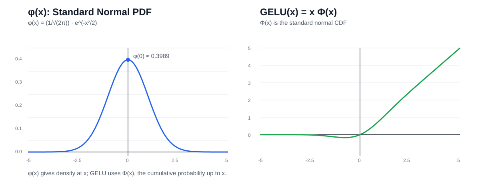

# 激活函数与门控 FFN：从 ReLU、GELU、SiLU 到 SwiGLU

> 本文记录 LLM 中常见激活函数，以及 GELU、SiLU、GLU、SwiGLU 之间的关系。

## 1. 为什么需要激活函数？

如果神经网络只有线性层：

\[
y=W_2(W_1x)=Wx
\]

无论叠多少层，本质上仍然只是一次线性变换。

加入非线性激活函数后：

\[
y=W_2\sigma(W_1x)
\]

网络才能表达复杂的非线性关系。

---

## 2. 常见激活函数对比

| 函数 | 公式 | 负区间 | 正区间 | 主要问题 / 特点 |
|---|---|---|---|---|
| Sigmoid | \(\sigma(x)=\frac{1}{1+e^{-x}}\) | 饱和 | 饱和 | 两端梯度趋近 0 |
| Tanh | \(\tanh(x)\) | 饱和 | 饱和 | 零中心，但仍有梯度饱和 |
| ReLU | \(\max(0,x)\) | 梯度 0 | 线性 | 可能出现 dying ReLU |
| GELU | \(x\Phi(x)\) | 平滑抑制 | 近似线性 | Transformer 中经典选择 |
| SiLU / Swish | \(x\sigma(x)\) | 平滑抑制 | 近似线性 | 现代模型常用 |
| SwiGLU | 门控 FFN 结构 | 门控控制 | 门控控制 | **不是单一标量激活函数** |

> **重要：SwiGLU 严格来说不是像 ReLU/GELU 那样的单输入标量激活函数，而是一种带门控的 FFN 结构。**

---

## 3. Sigmoid

\[
\sigma(x)=\frac{1}{1+e^{-x}}
\]

输出范围：

\[
0<\sigma(x)<1
\]

它很像一个 0～1 的“开关”。因此即使现在很少作为深层 Transformer 的主激活函数，仍大量用于各种 **gate**。

主要问题是当 \(|x|\) 很大时：

\[
\sigma'(x)\approx 0
\]

容易造成梯度饱和。

---

## 4. Tanh

\[
\tanh(x)=\frac{e^x-e^{-x}}{e^x+e^{-x}}
\]

输出范围：

\[
-1<\tanh(x)<1
\]

相较 Sigmoid，它的输出以 0 为中心，但正负两端同样会饱和。

---

## 5. ReLU

\[
\mathrm{ReLU}(x)=\max(0,x)
\]

特点非常直接：

\[
x<0\Rightarrow0
\]

\[
x>0\Rightarrow x
\]

优点是简单、高效；问题是负区间梯度恒为 0，某些神经元可能永久无法重新激活，即所谓 **dying ReLU**。

---

# 6. 正态分布里的 \(\phi(x)\) 与 \(\Phi(x)\)

这是理解 GELU 最容易混淆的地方。

## 6.1 小写 \(\phi(x)\)：概率密度函数 PDF

标准正态分布的概率密度函数：

\[
\boxed{
\phi(x)=\frac{1}{\sqrt{2\pi}}e^{-x^2/2}
}
\]

它是一条钟形曲线，并且关于 0 对称。

在 \(x=0\) 时达到最大值：

\[
\phi(0)=\frac{1}{\sqrt{2\pi}}\approx0.3989
\]

注意：\(\phi(x)\) 表示的是**概率密度**，不是“小于某个值的概率”。

## 6.2 大写 \(\Phi(x)\)：累积分布函数 CDF

\[
\boxed{
\Phi(x)=\int_{-\infty}^{x}\phi(t)\,dt
}
\]

它表示标准正态随机变量 \(Z\sim N(0,1)\) 满足：

\[
\Phi(x)=P(Z\le x)
\]

典型数值：

| \(x\) | \(\Phi(x)\) |
|---:|---:|
| -2 | 0.0228 |
| -1 | 0.1587 |
| 0 | 0.5000 |
| 1 | 0.8413 |
| 2 | 0.9772 |

因此：

\[
\phi(x)=\text{PDF}
\]

而：

\[
\Phi(x)=\text{CDF}
\]

**GELU 使用的是大写 \(\Phi(x)\)。**



---

# 7. GELU

GELU 全称：

> **Gaussian Error Linear Unit**

公式：

\[
\boxed{
\mathrm{GELU}(x)=x\Phi(x)
}
\]

这里的 \(\Phi(x)\) 就是上一节的标准正态分布 CDF。

因此可以把 GELU 理解为：

> 根据输入 \(x\) 的大小，用一个 0～1 之间的平滑系数 \(\Phi(x)\) 对 \(x\) 进行“软门控”。

例如：

\[
x=-1
\]

因为：

\[
\Phi(-1)\approx0.1587
\]

所以：

\[
\mathrm{GELU}(-1)\approx-0.1587
\]

而：

\[
x=1
\]

有：

\[
\mathrm{GELU}(1)\approx0.8413
\]

### ReLU vs GELU

ReLU 是硬截断：

\[
x<0\Rightarrow0
\]

GELU 更像平滑筛选：

\[
x<0\Rightarrow\text{通常压小，但不立即变成 0}
\]

所以 GELU 的曲线在 0 附近是连续而平滑的。

实际实现中通常使用近似形式来减少计算：

\[
\mathrm{GELU}(x)\approx
\frac{x}{2}
\left[
1+\tanh\left(\sqrt{\frac{2}{\pi}}(x+0.044715x^3)\right)
\right]
\]

---

# 8. SiLU / Swish

SiLU：

> **Sigmoid Linear Unit**

Swish 常见形式：

\[
\boxed{
\mathrm{SiLU}(x)=x\sigma(x)
}
\]

其中：

\[
\sigma(x)=\frac{1}{1+e^{-x}}
\]

所以它和 GELU 非常相似：

\[
\mathrm{GELU}(x)=x\Phi(x)
\]

\[
\mathrm{SiLU}(x)=x\sigma(x)
\]

两者都是：

\[
\boxed{x\times\text{一个 0～1 的平滑门控系数}}
\]

主要区别只是门控函数不同：

- GELU：正态分布 CDF \(\Phi(x)\)
- SiLU：Sigmoid \(\sigma(x)\)

---

# 9. GLU：Gated Linear Unit

GLU 的核心思想不是单纯“激活”，而是显式增加一条 **gate 分支**。

简化形式：

\[
\boxed{
\mathrm{GLU}(x)=A(x)\odot\sigma(B(x))
}
\]

其中 \(\odot\) 表示逐元素乘法。

可以直观理解成：

```text
              ┌── value ─────────┐
x ────────────┤                  × ── output
              └── gate → sigmoid ┘
```

一条分支负责产生信息，一条分支负责决定这些信息应该放行多少。

---

# 10. SwiGLU

SwiGLU 是：

> **Swish-Gated Linear Unit**

即使用 **Swish / SiLU** 作为门控激活的 GLU 变体。

现代 LLM 中常见写法：

\[
\boxed{
\mathrm{FFN}(x)=
W_{down}
\left[
\mathrm{SiLU}(W_{gate}x)\odot(W_{up}x)
\right]
}
\]

数据流：

```text
                     ┌── W_gate ── SiLU ──┐
x ───────────────────┤                    × ── W_down ── output
                     └── W_up ─────────────┘
```

对应很多 LLaMA 风格实现中的三个名字：

```text
gate_proj
up_proj
down_proj
```

伪代码：

```python
def forward(x):
    return down_proj(
        silu(gate_proj(x)) * up_proj(x)
    )
```

## 为什么门控有用？

普通 FFN 更像：

\[
\mathrm{GELU}(W_1x)
\]

SwiGLU 则允许两组特征发生乘法交互：

\[
\mathrm{SiLU}(W_gx)\odot(W_vx)
\]

也就是模型可以学习：

> “当 A 特征存在时，B 特征应该放行多少。”

这比单一路径的逐元素激活具有更强的条件表达能力。

---

# 11. 为什么 SwiGLU 的 hidden size 经常不是 \(4d\)？

传统 Transformer FFN 通常：

\[
d_{ff}=4d
\]

两层线性层的参数量约为：

\[
d\times4d+4d\times d=8d^2
\]

SwiGLU 有三个线性矩阵：

\[
W_{gate},\;W_{up},\;W_{down}
\]

参数量约为：

\[
3d\,d_{ff}
\]

如果希望和传统 FFN 参数量大致相当：

\[
3d\,d_{ff}\approx8d^2
\]

得到：

\[
\boxed{
d_{ff}\approx\frac{8}{3}d
}
\]

例如：

\[
d=4096
\]

则：

\[
\frac{8}{3}\times4096\approx10923
\]

真实模型通常还会为了 GPU / Tensor Core 计算效率，把维度调整到更方便的整数倍。

---

# 12. 一张表记住核心区别

| 方法 | 核心公式 | 本质 |
|---|---|---|
| ReLU | \(\max(0,x)\) | 硬截断 |
| GELU | \(x\Phi(x)\) | 正态 CDF 软门控 |
| SiLU | \(x\sigma(x)\) | Sigmoid 软门控 |
| GLU | \(A\odot\sigma(B)\) | 双分支显式门控 |
| SwiGLU | \(A\odot\mathrm{SiLU}(B)\) | SiLU + GLU 门控结构 |

可以按下面的关系记忆：

```text
ReLU
 │
 ├─→ GELU：把硬截断改成平滑概率式门控
 │
 └─→ SiLU：使用 sigmoid 形成平滑自门控
          │
          └─→ SwiGLU：把 SiLU 放进双分支 GLU 结构
```

---

# 13. 本节最重要的五句话

1. \(\phi(x)\) 是标准正态分布 **PDF**。
2. \(\Phi(x)\) 是标准正态分布 **CDF**。
3. GELU 的公式是 \(x\Phi(x)\)，用的是大写 \(\Phi\)。
4. SiLU 的公式是 \(x\sigma(x)\)。
5. **SwiGLU 不是单纯的激活函数，而是带 SiLU 门控的双分支 FFN 结构。**

## 下一步建议

理解完 SwiGLU 后，最自然的下一步是学习：

- FFN 在 Transformer Block 中的位置；
- 为什么现代 LLM 用 RMSNorm；
- Attention 与 FFN 分别承担什么功能；
- LLaMA Transformer Block 的完整数据流。
