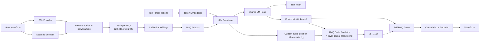

# StepAudio 3 Gen：离散自回归统一音频生成

> 论文：**StepAudio 3 Gen Technical Report**（2026-09-11）  
> arXiv: https://arxiv.org/abs/2609.12945  
> Hugging Face Papers: https://huggingface.co/papers/2609.12945  
> Demo: https://stepaudiollm.github.io/step-audio-3-gen/

## 1. 一句话总结

StepAudio 3 Gen 的核心不是单纯把 TTS 做得更好，而是把 **TTS、Voice Design、歌声、音乐、音效、Vibe Speech 和混合音频**统一到同一套离散自回归框架中：

- **StepAudio Tokenizer** 把通用音频编码成 12.5 Hz、16 层 RVQ 离散码；
- **大 LLM** 只沿时间轴预测每帧第一层码本 `c0`；
- **小型 RVQ Code Predictor** 在当前帧内部继续预测 `c1...c15`；
- 完整 16 层 RVQ code 再由 **Causal Vocos Decoder** 解码为 waveform；
- 历史完整 RVQ frame 又可以通过 **RVQ Adaptor** 重新注入 LLM，使后续生成不只依赖过去的 `c0`。

最值得记住的一句话：

> **大 LLM 做时间维的高层规划，小 Transformer 做 RVQ 深度维的细节补全；完整声学结果再反馈给 LLM。**

---

## 2. 整体架构



整体可以看成三个模块：

1. **StepAudio Tokenizer**：把波形变成离散 RVQ code；
2. **LLM Backbone**：负责文本能力、音频理解，以及 `c0` 的时间轴生成；
3. **RVQ Code Predictor**：根据当前 LLM hidden state 和 `c0` 补齐 `c1...c15`。

---

## 3. StepAudio Tokenizer：12.5 Hz + 16 层 RVQ

### 3.1 两路特征融合

原始音频同时进入：

- **SSL Encoder**：提供偏语义 / 内容 / 韵律的信息；
- **Acoustic Encoder**：从 waveform 提取更底层的声学信息。

两路特征融合、下采样后进入 RVQ。每个时间帧最终表示为：

```text
[c0, c1, c2, ..., c15]
```

关键参数：

| 项目 | 配置 |
|---|---|
| 时间帧率 | 12.5 Hz |
| 每帧时长 | 80 ms |
| RVQ 层数 | 16 |
| 每层 codebook size | 2048 |
| 输出音频 | 24 kHz |
| Decoder | fully causal Vocos-style decoder |

一分钟音频在**时间轴上只有约 750 个 frame**：

```text
60 × 12.5 = 750
```

这使得主 LLM 做长音频自回归生成变得可行。

### 3.2 不是硬拆成“semantic code + acoustic code”

StepAudio 3 Gen 并不是简单规定：

```text
c0 = semantic
c1...c15 = acoustic
```

论文强调，16 层 codebook 共同量化 semantic + waveform-level acoustic feature，因此各层都同时携带这两类信息。

不过 RVQ 天然是 coarse-to-fine：前层先解释主要信号，后层补 residual，因此 `c0` 更适合承担高层规划。

训练上还用了：

- **semantic distillation**：让量化表示保留 SSL teacher 的语义信息；
- **quantizer dropout = 0.5**：训练时随机丢掉后续 residual codebook，迫使浅层本身也保留足够信息。

这为“LLM 只生成 `c0`”提供了基础。

---

## 4. Time × Depth：大模型沿时间，小模型沿 RVQ 深度

### 4.1 时间轴：大 LLM 只预测 `c0`

假设音频有 T 个 frame，主 LLM 只做：

```text
c0_1 -> c0_2 -> c0_3 -> ... -> c0_T
```

如果把 16 层 RVQ 全部 flatten 给大 LLM：

```text
c0_1, c1_1, ..., c15_1,
c0_2, c1_2, ..., c15_2,
...
```

主 LLM 的 audio token rate 会从：

```text
12.5 token/s
```

变成约：

```text
12.5 × 16 = 200 token/s
```

因此 StepAudio 把昂贵的长程建模只留给 `c0`。

### 4.2 深度轴：小 Predictor 补 `c1...c15`

对第 t 帧，LLM 先得到当前 contextual hidden state `h_t`，预测 `c_{t,0}`，然后 4-layer causal Transformer 在 codebook depth 上继续：

```text
(h_t, c0_t)
      |
      v
c1_t -> c2_t -> ... -> c15_t
```

概率分解可近似写成：

```text
P(audio)
≈ Π_t P(c_t,0 | history)
  × Π_t Π_k=1..15 P(c_t,k | h_t, c_t,<k)
```

二维 RVQ grid 可以画成：

```text
                 时间 ->
             t0   t1   t2   t3
c0           ● -> ● -> ● -> ●      Big LLM
             |    |    |    |
c1           ●    ●    ●    ●
             |    |    |    |
c2           ●    ●    ●    ●      Small RVQ Predictor
             |
...          |
c15          ●    ●    ●    ●

             深度 ↓
```

所以所谓 **Time-Depth Modeling** 本质就是：

- **Big LLM = time-axis modeling**；
- **Small Transformer = RVQ-depth modeling**。

---

## 5. 这个 Time-Depth 思路并不是 StepAudio 首创

如果只看“大模型沿时间，小模型沿量化深度”，StepAudio 3 Gen 属于一条很清楚的技术谱系。

| 工作 | 时间 | 与 StepAudio 3 Gen 的关系 |
|---|---:|---|
| **RQ-Transformer** | 2022 | 空间/时间轴大 Transformer + residual-depth 小 Transformer，是 time-depth 架构的重要前身 |
| **AudioLM** | 2022 | 语义 → coarse acoustic → fine acoustic 的分层生成思想 |
| **VALL-E** | 2023 | 第一层 codec token 沿时间 AR，剩余 RVQ 层再补细节 |
| **SpeechTokenizer** | 2023 | 用 SSL/HuBERT 蒸馏强化前层 RVQ 的 semantic 信息 |
| **MusicGen** | 2023 | 同样处理多 RVQ stream，但用 delay pattern，而不是 depth Transformer |
| **SoundStorm** | 2023 | RVQ coarse-to-fine，但时间轴上采用 masked/parallel decoding |
| **Moshi / Mimi** | 2024 | 音频领域里与 StepAudio 最接近：Temporal Transformer + Depth Transformer；Mimi 同样是低帧率 RVQ，并强化浅层 semantic 信息 |

### 5.1 和 VALL-E 的区别

VALL-E 的核心思想是：

```text
先把整句话的第一层生成完
c0_1 -> c0_2 -> ... -> c0_T

再补整条第二层、第三层……
c1_1  c1_2 ... c1_T
c2_1  c2_2 ... c2_T
```

它已经建立了“第一层负责主要结构、后续 residual 层补细节”的分工。

StepAudio 更强调每一个时间位置内部的 **depth autoregression**：

```text
当前 frame:
c0_t -> c1_t -> c2_t -> ... -> c15_t
```

因此，如果问“LLM 只预测第一层是不是很像 VALL-E”，答案是**是**；但如果问“StepAudio 这套 time-depth 的具体骨架最像谁”，则 **Moshi / RQ-Transformer 更接近**。

### 5.2 和 Moshi 的相似性更直接

Moshi 可以概括为：

```text
Temporal Transformer
        |
      h_t
        |
Depth Transformer
        |
q1 -> q2 -> ... -> qK
```

StepAudio：

```text
LLM Backbone
      |
     h_t
      |
预测 c0
      |
RVQ Code Predictor
      |
c1 -> c2 -> ... -> c15
```

两者都把：

> **长程时间依赖交给大模型，当前 frame 内的多码本细节交给小模型。**

因此 StepAudio 的新意更适合放在“统一 general audio 表征 + RVQ Adaptor + 干扰控制训练 + 完整声学反馈闭环”上，而不是把 time-depth 本身视为从零开始的新结构。

参考：

- RQ-Transformer: https://arxiv.org/abs/2203.01941
- VALL-E: https://arxiv.org/abs/2301.02111
- AudioLM: https://arxiv.org/abs/2209.03143
- SpeechTokenizer: https://arxiv.org/abs/2308.16692
- MusicGen: https://arxiv.org/abs/2306.05284
- SoundStorm: https://arxiv.org/abs/2305.09636
- Moshi: https://arxiv.org/abs/2410.00037

---

## 6. RVQ Predictor 收到的是哪个 hidden state？

RVQ Code Predictor **不是显式接收此前所有位置的 LLM hidden states**，而是接收当前音频位置的一个 contextual hidden state `h_t`。

```text
历史文本 + 历史音频 frame
          |
          v
      causal LLM
          |
          v
      当前 h_t
       /     \
      /       \
预测 c0_t    RVQ Predictor
               |
        c1_t ... c15_t
```

虽然只给 Predictor 一个 `h_t`，但 `h_t` 经过 causal self-attention / KV cache 已经聚合了此前上下文，因此不是“只包含最后一个 token 局部信息”的向量。

> **LLM 负责把长历史压进当前 contextual state；RVQ Predictor 不需要再次 attention 全部历史。**

---

## 7. 为什么 LLM Head 还会输出 Text Tokens？

StepAudio 3 Gen 不是只会 TTS 的声学模型，而是保留文本能力的 Audio LLM。

第一层 codebook 的 2048 个 token 被加入主 LLM vocabulary，并和文本 token 共用 LM head：

```text
Joint vocabulary
├── normal text tokens
└── 2048 codebook-0 audio tokens
```

因此同一个 LM head 可以生成：

```text
Text Token
   or
Audio c0 Token
```

这不意味着每一步同时生成文字和音频，而是当前 instruction / role / sequence format 决定下一 token 应该来自哪一类。

例如：

```text
任务：这段录音说了什么？
-> 输出 text tokens

任务：用这个声音说“你好”
-> 输出 c0 audio tokens
```

论文说明了共享主 LM head；但技术报告没有完整披露线上服务是否会针对具体任务额外使用 vocabulary mask，因此不要把“完全自由采样整个联合词表”当成已确认的工程实现。

---

## 8. RVQ Adaptor + Token Embedding 到底是什么意思？

这是理解 StepAudio 3 Gen 很关键的一点。

### 8.1 `c0` 有一条普通 LLM Token Embedding 路径

因为 `c0` codebook 已经加入 LLM vocabulary，所以一个 `c0` token 可以像普通文字 token 一样做 embedding lookup：

```text
c0 = 317
   |
LLM Token Embedding
   |
E_token(c0)
```

这条路径的意义是：

> **让 audio 的第一层 token 真正成为 LLM 自回归序列的一部分。**

### 8.2 完整 16 层 RVQ 还有另一条 Audio Embedding 路径

对一个已知音频 frame：

```text
c0  -> E0(c0)  --\
c1  -> E1(c1)    \
c2  -> E2(c2)     +--> SUM --> RVQ Adaptor --> e_audio
...                /
c15 -> E15(c15) --/
```

即每个 codebook 有自己的 embedding table，然后把 16 个向量求和：

```text
e_RVQ = Σ_k E_k(c_k)
```

再通过 RVQ Adaptor。

最终送入 LLM 的 audio-position embedding 可以理解为：

```text
x_t = E_token(c_t,0)
      + A( Σ_k=0..15 E_k(c_t,k) )
```

其中 `A` 就是 RVQ Adaptor。

### 8.3 为什么 `c0` 看起来出现了两次？

是的，概念上 `c0` 同时参与：

```text
c0 -> LLM token embedding
```

和：

```text
c0 -> RVQ codebook-0 embedding
      + c1...c15
      -> RVQ Adaptor
```

两条支路职责不同：

- **Token Embedding(c0)**：告诉 LLM “这是哪个主序列 audio token”；
- **RVQ Adaptor(c0...c15)**：告诉 LLM “这一帧完整的声学状态是什么”。

### 8.4 为什么不直接把 16 个 RVQ embedding 的和塞进 LLM？

因为 pretrained LLM 原有 token embedding 已经形成稳定分布；新建的 16 个 audio codebook embedding 直接相加，尺度和统计分布可能严重 mismatch。

RVQ Adaptor 是一个 token-wise residual module，并采用 **zero initialization**。训练初期：

```text
A(e_RVQ) ≈ 0
```

因此：

```text
x_t ≈ E_token(c0)
```

不会刚开始就让随机初始化的多码本声学信息冲击 pretrained LLM；之后 Adaptor 再逐渐学会把完整声学信息注入主干。

这也是论文中 RVQ Adaptor ablation 对 ASR / audio understanding / speech translation 提升很大的原因之一。

---

## 9. 一个很重要的共同点：StepAudio 与 VoxCPM 都有 Acoustic Feedback Loop

这是 StepAudio 3 Gen 和 VoxCPM 很值得放在一起看的地方。

严格来说，两者都不是“把最终 waveform 再送回 LM”，而是：

> **把已经生成出来的完整声学 latent / code 重新编码成 LM 能吃的 embedding，再作为下一步历史上下文。**

### 9.1 StepAudio 3 Gen

当前第 t 帧：

```text
LLM h_t
  |
 c0_t
  |
RVQ Predictor
  |
[c0...c15]_t
```

生成完整 RVQ frame 后，历史音频在下一步可以通过：

```text
[c0...c15]_t
      |
16-codebook embeddings
      |
     sum
      |
RVQ Adaptor
      |
+ c0 token embedding
      |
     LLM
      |
    h_t+1
```

因此后续 LLM 不只是知道：

```text
“我上一帧计划了哪个 c0”
```

还可以得到：

```text
“上一帧最终完整生成成了什么声学状态”
```

### 9.2 VoxCPM

VoxCPM 是连续 latent 路线。其生成过程可写成：

```text
TSLM -> FSQ semantic/prosodic skeleton
              +
             RALM
              |
           LocDiT
              |
        VAE latent z_i
              |
           LocEnc
              |
 acoustic embedding E_i
              |
          back to TSLM
```

论文中历史声学上下文写成：

```text
E_<i = LocEnc(Z_<i)
```

TSLM 在生成下一 latent patch 时条件于 `T` 与 `E_<i`。

参考：VoxCPM https://arxiv.org/abs/2509.24650

### 9.3 两者可以这样对齐

| | StepAudio 3 Gen | VoxCPM |
|---|---|---|
| 主规划模型 | LLM Backbone | TSLM |
| 高层/粗规划 | `c0` | TSLM hidden + FSQ |
| 声学细节模型 | RVQ Predictor | RALM + LocDiT |
| 最终生成表示 | 完整 16 层 RVQ frame | continuous VAE latent patch `z_i` |
| 历史重新编码 | RVQ embeddings + RVQ Adaptor | LocEnc |
| 反馈给 | 下一步 LLM | 下一步 TSLM |
| 直接反馈 waveform？ | 否 | 否 |

两者共同思想可以概括为：

> **LM 不只记住“我打算生成什么”，还重新感知“我实际生成成了什么”。**

这对长程连续语音尤其重要，因为 renderer / acoustic model 的实际输出可能与高层 planning state 有细微偏差；若主 LM 永远只看自己的粗计划，偏差可能逐步积累。

因此 RVQ Adaptor 不应只理解成“外部音频理解接口”，它同时也是一个很重要的 **generation-history acoustic feedback interface**。

---

## 10. Encoder 和 Decoder 都是因果的吗？

不是这么简单。

### 10.1 Decoder：论文明确是 fully causal

StepAudio Tokenizer 的 Vocos-style decoder 被明确设计为 **fully causal**，用于增量恢复 waveform。

这对流式生成非常重要：

```text
LLM -> c0_t
       |
RVQ Predictor -> c1...c15_t
       |
Causal Vocos
       |
立即产生当前 waveform segment
```

如果 decoder 依赖未来 audio token，那么即使 LLM 当前 frame 已经生成出来，也还要等待未来 frame，首包和流式延迟都会变差。

### 10.2 Encoder：论文没有给出同样的 fully-causal 保证

编码侧是：

```text
waveform
  |\
  | \-> SSL Encoder
  |----> Acoustic Encoder
          |
      Feature Fusion
          |
      Downsample + RVQ
```

论文没有明确声明整个 encoder 是 fully causal，也没有证明每个编码位置都不看未来帧。

因此正确说法是：

> **不能根据 causal decoder 推断 tokenizer encoder 也是 causal。**

尤其 SSL branch 若使用常见双向上下文 SSL encoder，则整体编码路径更不能自动视为 strict streaming encoder；但论文没有披露足够细节，因此这里应保持为“未确认”，而不是武断说一定非因果。

### 10.3 系统中还有另外两个 causal

不要混淆三种 causal：

1. **LLM Backbone**：decoder-only causal，沿时间生成 `c0`；
2. **RVQ Code Predictor**：causal Transformer，沿 RVQ depth 生成 `c1...c15`；
3. **Vocos Decoder**：fully causal，沿时间把 RVQ frame 解成 waveform。

所以可以说：

> **StepAudio 的音频“生成链路”基本是因果的，但论文并没有证明“Tokenizer Encoder + Decoder 全链路都严格因果”。**

---

## 11. 为什么不用 Diffusion / Flow Matching？

近期很多通用音频系统大致是：

```text
LLM / Transformer
      |
continuous latent
      |
DiT / Flow Matching / Diffusion
      |
waveform
```

StepAudio 3 Gen 则坚持：

```text
LLM
 |
discrete c0
 |
discrete c1...c15
 |
codec decoder
 |
waveform
```

也就是**纯离散自回归生成 + causal codec decoder**，没有额外大型 diffusion / flow acoustic renderer。

优点：

- text / audio 更自然地共享自回归框架；
- 方便 interleave；
- streaming 逻辑自然；
- 主 LLM 只需要 12.5 Hz 时间步。

代价：

- 仍然存在 autoregressive latency；
- 音质上限受 tokenizer / codec reconstruction quality 影响；
- 多层 RVQ 的训练与梯度平衡更复杂。

---

## 12. Progressive Pretraining：重点是“别把原 LLM 训坏”

论文把模态干扰作为核心问题，采用四阶段渐进式预训练，整个预训练约消耗 **2.7T LLM tokens**。

### Stage 1：Modality Alignment

- 冻结 LLM Backbone / LM Head；
- 训练 Audio Embedding 和 RVQ Adaptor；
- 以 ASR、speech-to-text translation 等任务把音频表示对齐到 LLM space。

### Stage 2：Audio Understanding

- 解冻 LLM；
- 加入 audio understanding；
- 从这一阶段开始维持较高比例文本 replay，防止文本能力退化。

### Stage 3：Audio Generation

开始训练 TTS / interleaved audio generation。

关键技巧：

```text
LLM hidden state
      |
   stop-gradient
      |
RVQ Code Predictor
```

因为 `c1...c15` 一共有 15 层声学 loss。如果 Predictor 还是随机初始化时就把这些 loss 全部反传给 LLM，容易让大批声学梯度破坏已经对齐好的主干表示。

因此先让 Predictor 独立学会 acoustic completion。

### Stage 4：Joint Cool-down

等 Predictor 收敛后：

- 移除 stop-gradient；
- 用较低学习率联合训练；
- 扩大上下文长度；
- 降低 residual-depth loss 的相对权重。

整体思想：

> **先隔离学习，再谨慎联合优化。**

---

## 13. 数据规模与后训练

论文披露的几个量级：

| 阶段 | 规模 |
|---|---:|
| Tokenizer 预训练 | 约 700k 小时音频 |
| LLM progressive pretraining | 约 2.7T tokens |
| SFT 总音频 | 约 5,000 小时 |
| 其中自然 conversational speech | 约 1,500 小时 |

后训练还使用了 GRPO。大致流程：

```text
instruction
   |
一次采样多个候选 audio
   |
audio understanding model -> caption
   |
LLM judge -> instruction consistency score
   |
有 transcript 的 speech 再加入 CER/WER penalty
   |
GRPO update
```

目标不仅是音色或音质，还包括：

- 指令一致性；
- 内容正确性；
- 风格 / 场景控制。

---

## 14. 从传统 TTS 到 General Audio Generator

传统 TTS 更接近：

```text
Text
 |
semantic / acoustic model
 |
mel / latent
 |
vocoder
 |
speech
```

StepAudio 3 Gen 更像：

```text
Text / Audio Context
        |
   General Audio LLM
        |
 temporal c0 planning
        |
 RVQ depth completion
        |
 shared codec decoder
        |
Speech / Singing / Music / SFX / Mixed Audio
```

因此目标已经从：

> “把文本读出来”

变成：

> “用同一套 token space 和生成框架建模各种声音。”

---

## 15. 实验结果怎么看

论文报告 StepAudio 3 Gen 在 TTS human-likeness、Voice Design 等评测上表现很强，同时展示了音乐、歌声、音效和混合场景生成能力。

阅读结果时需要注意：

- TTS 的一部分结果来自论文自建中文 human-likeness Arena；
- Voice Design 有相对系统化的 instruction-following 评测；
- 音乐、复杂音效、Vibe Speech 更大程度仍以 capability demo 为主；
- 论文没有完整披露训练和在线推理成本。

因此最有说服力的贡献首先还是**架构组合和训练 recipe**，而不应只看某个总榜单数字。

---

## 16. 开源状态（截至 2026-09-16）

目前可以确认：

- 技术报告：已公开；
- Demo / samples：已公开；
- StepAudio 3 Gen 主模型权重：尚未看到官方公开；
- 新版 StepAudio Tokenizer 权重：尚未看到官方公开；
- 完整 inference code：尚未看到官方公开；
- 官方明确开源时间表：尚未看到。

前代 Step-Audio 系列有过开源记录，但不能据此推断 StepAudio 3 Gen 一定会开源。

---

## 17. 最值得记住的 7 个点

1. **12.5 Hz、16×2048 RVQ**：极低时间帧率，使长音频 LLM 建模可行；
2. **Time × Depth factorization**：LLM 预测 `c0`，小 Transformer 补 `c1...c15`；
3. **这个结构不是首创**：VALL-E 已有“第一层 + residual”分工，Moshi / RQ-Transformer 与具体 time-depth 骨架更接近；
4. **Shared LM Head**：text token 和 `c0` token 位于统一自回归输出空间；
5. **RVQ Adaptor + Token Embedding**：`c0` 作为主序列 token，同时完整 `c0...c15` 通过 Adaptor 注入声学信息；
6. **Acoustic feedback loop**：历史完整 RVQ frame 会重新变成 LLM 可消费的表示，这一点和 VoxCPM 的 `LocEnc(Z_<i>) -> TSLM` 很像；
7. **Interference-aware training**：zero-init adaptor、文本 replay、predictor gradient detach、joint cool-down 都围绕“获得音频能力但不毁掉 LLM”。

如果只记两句话：

> **StepAudio 3 Gen 的主干并不新在“LLM 只预测第一层”，真正值得看的是它如何把成熟的 time-depth codec-LM 结构扩展成 general audio model。**

> **相比只看自己的粗规划，StepAudio 还把最终完整声学表示重新反馈给 LLM；这和 VoxCPM 的历史 acoustic latent feedback 是一个非常值得对照的共同点。**
