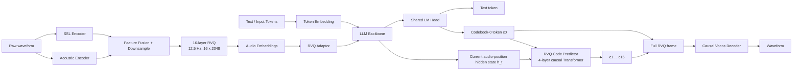

# StepAudio 3 Gen：离散自回归统一音频生成

> 论文：**StepAudio 3 Gen Technical Report**（2026-09-11）  
> arXiv: https://arxiv.org/abs/2609.12945  
> Hugging Face Papers: https://huggingface.co/papers/2609.12945  
> Demo: https://stepaudiollm.github.io/step-audio-3-gen/

## 1. 一句话总结

StepAudio 3 Gen 的核心不是单纯把 TTS 做得更好，而是把 **TTS、Voice Design、歌声、音乐、音效、Vibe Speech 和混合音频**统一到同一套离散自回归框架中：

- **StepAudio Tokenizer** 把通用音频编码成 12.5 Hz、16 层 RVQ 离散码；
- **大 LLM** 只沿时间轴预测每帧的第一层码本 `c0`；
- **小型 RVQ Code Predictor** 在当前帧内部继续预测 `c1...c15`；
- 完整的 16 层 RVQ code 再由 **Causal Vocos Decoder** 解码成 waveform。

最值得记住的一句话是：

> **大 LLM 做时间维的语义/韵律规划，小 Transformer 做 RVQ 深度维的声学细节补全。**

---

## 2. 整体架构



整体可以看成三个模块：

1. **StepAudio Tokenizer**：把波形变成离散 RVQ code；
2. **LLM Backbone**：负责文本能力、音频理解，以及 `c0` 的时间轴生成；
3. **RVQ Code Predictor**：根据 LLM hidden state 和 `c0` 补齐 `c1...c15`。

---

## 3. StepAudio Tokenizer：12.5 Hz + 16 层 RVQ

### 3.1 两路特征融合

原始音频同时进入：

- **SSL Encoder**：提供偏语义、内容、韵律的信息；
- **Acoustic Encoder**：从 waveform 提取更底层的声学信息。

两路特征融合、下采样后进入 RVQ。

最终每个时间帧表示为：

```text
[c0, c1, c2, ..., c15]
```

关键参数：

| 项目 | 配置 |
|---|---|
| 时间帧率 | 12.5 Hz |
| 每帧时长 | 80 ms |
| RVQ 层数 | 16 |
| 每层 codebook size | 2048 |
| 输出音频 | 24 kHz |
| Decoder | causal Vocos-style decoder |

因此一分钟音频在**时间轴上只有约 750 个 frame**：

```text
60 × 12.5 = 750
```

这使得主 LLM 做长音频自回归生成变得可行。

### 3.2 每层不是“纯 semantic / 纯 acoustic”硬拆分

StepAudio 3 Gen 的 tokenizer 并不是简单规定：

```text
c0 = semantic
c1...c15 = acoustic
```

论文强调，16 层 codebook 共同量化 semantic + waveform-level acoustic feature，因此每层都保留两类信息。

不过 RVQ 天然是 coarse-to-fine：前层必须先解释更多信号，后层主要补 residual，因此 `c0` 会更适合承担高层规划。

训练上还用了：

- **semantic distillation**：让量化表示保留 SSL teacher 的语义信息；
- **quantizer dropout = 0.5**：训练时随机丢掉后续 residual codebook，迫使前层单独也保留足够信息。

这为“LLM 只生成 `c0`”提供了基础。

---

## 4. 最关键的改动：Time × Depth 两级自回归

这是 StepAudio 3 Gen 的核心架构思想。

### 4.1 时间轴：大 LLM 只预测 `c0`

假设音频有 T 个 frame，主 LLM 只做：

```text
c0_1 -> c0_2 -> c0_3 -> ... -> c0_T
```

也就是沿**时间维**自回归。

如果把 16 层 RVQ 全部 flatten 给大 LLM：

```text
c0_1, c1_1, ..., c15_1,
c0_2, c1_2, ..., c15_2,
...
```

那么 token rate 会从：

```text
12.5 token/s
```

变成约：

```text
12.5 × 16 = 200 token/s
```

大 LLM 的序列长度和推理开销都会大幅上升。

### 4.2 深度轴：小 Predictor 补 `c1...c15`

对第 t 帧，主 LLM 产生当前音频位置的 hidden state `h_t`，并预测 `c_{t,0}`。

然后 4-layer causal Transformer 做：

```text
(h_t, c0_t)
      |
      v
c1_t -> c2_t -> ... -> c15_t
```

可以写成近似概率分解：

```text
P(audio)
≈ Π_t P(c_t,0 | history)
  × Π_t Π_k=1..15 P(c_t,k | h_t, c_t,<k)
```

因此系统把两个难题拆开：

- **长程时间依赖**：大 LLM；
- **单帧内部的高保真声学细节**：小 Transformer。

---

## 5. RVQ Predictor 收到的是哪个 hidden state？

一个容易混淆的点是：

> RVQ Code Predictor **不是显式接收此前所有位置的 LLM hidden states**，而是接收**当前音频位置的一个 contextual hidden state `h_t`**。

数据流可以理解为：

```text
历史文本 + 历史音频 frame
          |
          v
      causal LLM
          |
          v
      当前 h_t
       /     \
      /       \
预测 c0_t    RVQ Predictor
               |
        c1_t ... c15_t
```

虽然只传一个 `h_t`，但 `h_t` 通过 causal self-attention / KV cache 已经聚合了此前上下文，因此它不是“只包含最后一个 token 局部信息”的向量。

换句话说：

> **LLM 负责把长历史压进当前 contextual state；RVQ Predictor 不再重复 attention 整个历史。**

---

## 6. 为什么 LLM Head 还会输出 Text Tokens？

因为 StepAudio 3 Gen 不是一个只会 TTS 的声学模型，而是保留了完整文本能力的 Audio LLM。

第 0 层 codebook 的 2048 个 token 被加入主 LLM vocabulary，并和文本 token 共用 LM head。

可理解为：

```text
Joint vocabulary
├── normal text tokens
└── 2048 codebook-0 audio tokens
```

所以同一个 LM head 可以生成：

```text
Text Token
   or
Audio c0 Token
```

这并不意味着每一步同时生成一份文字和一份音频，而是当前上下文决定下一 token 属于哪个区域。

例如：

```text
任务：这段录音说了什么？
-> 输出 text tokens

任务：用这个声音说“你好”
-> 输出 c0 audio tokens
```

因此 StepAudio 3 Gen 能把 text / audio 放入同一个 autoregressive stream，并支持交错上下文。

### 推理时如何知道输出 Text 还是 `c0`？

模型在训练中通过 instruction、角色格式和监督数据学到当前应该生成哪种 token。

联合 softmax 的概念可以理解为：

```text
LM hidden state
      |
      v
shared LM head
      |
      +-- logits over text vocabulary
      |
      +-- logits over 2048 c0 tokens
```

如果采样到 `c0` token，系统就触发 RVQ Code Predictor，补齐当前 frame 的 `c1...c15`。

论文说明了共享主 LM head；但技术报告没有把线上推理是否针对具体任务额外使用 vocabulary mask 讲得非常具体，因此不要把“完全自由采样”当成已确认的服务端实现细节。

---

## 7. RVQ Adaptor：把完整声学信息重新注入 LLM

音频输入侧不是只给 LLM `c0`。

对已有音频 frame：

```text
[c0, c1, ..., c15]
      |
16 个 codebook embeddings 求和
      |
      v
 RVQ Adaptor
      |
      +
normal token embedding
      |
      v
     LLM
```

RVQ Adaptor 是 token-wise residual module，并采用**零初始化**。

目的有两个：

1. 让 LLM 输入侧能够看到完整的多码本声学信息，而不是只看到 `c0`；
2. 避免随机初始化的音频 embedding 直接破坏 pretrained LLM 原有表示分布。

一个很重要的理解是：

> **输出侧只让大 LLM 预测 `c0`，但输入侧历史音频可以通过 RVQ Adaptor 把完整 `c0...c15` 信息重新注入 LLM。**

因此后续帧的 `h_t` 可以间接利用过去更完整的声学状态。

---

## 8. 为什么不用 Diffusion / Flow Matching？

近期很多通用音频系统大致是：

```text
LLM / Transformer
      |
continuous latent
      |
DiT / Flow Matching / Diffusion
      |
waveform
```

StepAudio 3 Gen 则坚持：

```text
LLM
 |
discrete c0
 |
discrete c1...c15
 |
codec decoder
 |
waveform
```

也就是**纯离散自回归生成 + causal codec decoder**，没有额外的大型 diffusion / flow acoustic renderer。

优点：

- text / audio 更自然地共享自回归框架；
- 方便 interleave；
- streaming 逻辑自然；
- 主 LLM 只需要 12.5 Hz 时间步。

代价：

- 仍然存在 autoregressive latency；
- 音质上限受 tokenizer / codec reconstruction quality 影响；
- 多层 RVQ 的训练与梯度平衡比较复杂。

---

## 9. Progressive Pretraining：重点是“别把原 LLM 训坏”

论文把模态干扰作为核心问题，采用四阶段渐进式预训练，整个预训练约消耗 **2.7T LLM tokens**。

### Stage 1：Modality Alignment

- 冻结 LLM Backbone / LM Head；
- 训练 Audio Embedding 和 RVQ Adaptor；
- 以 ASR、speech-to-text translation 等任务把音频表示对齐到 LLM space。

### Stage 2：Audio Understanding

- 解冻 LLM；
- 加入 audio understanding；
- 从这一阶段开始维持较高比例文本 replay，防止文本能力退化。

### Stage 3：Audio Generation

开始训练 TTS / interleaved audio generation。

最关键的技巧：

```text
LLM hidden state
      |
   stop-gradient
      |
RVQ Code Predictor
```

因为 `c1...c15` 一共有 15 层声学 loss，如果 Predictor 还是随机初始化时就直接全部反传到 LLM，容易让声学梯度破坏已经对齐好的主干表示。

因此先让 Predictor 独立学会 acoustic completion。

### Stage 4：Joint Cool-down

等 Predictor 收敛后：

- 移除 stop-gradient；
- 用较低学习率联合训练；
- 扩大上下文长度；
- 降低 residual depth loss 的相对权重。

整体思想是：

> **先隔离学习，再谨慎联合优化。**

---

## 10. 数据规模与后训练

论文披露的几个量级：

| 阶段 | 规模 |
|---|---:|
| Tokenizer 预训练 | 约 700k 小时音频 |
| LLM progressive pretraining | 约 2.7T tokens |
| SFT 总音频 | 约 5,000 小时 |
| 其中自然 conversational speech | 约 1,500 小时 |

后训练还使用了 GRPO。

大致流程：

```text
instruction
   |
一次采样多个候选 audio
   |
audio understanding model -> caption
   |
LLM judge -> instruction consistency score
   |
有 transcript 的 speech 再加入 CER/WER penalty
   |
GRPO update
```

其目的不是只优化“音色像不像”，而是让生成结果同时满足：

- 指令一致性；
- 内容正确性；
- 风格 / 场景控制。

---

## 11. StepAudio 3 Gen 相比传统 TTS 的本质变化

传统 TTS 更接近：

```text
Text
 |
semantic / acoustic model
 |
mel / latent
 |
vocoder
 |
speech
```

StepAudio 3 Gen 更像：

```text
Text / Audio Context
        |
   General Audio LLM
        |
 temporal c0 planning
        |
 RVQ depth completion
        |
 shared codec decoder
        |
Speech / Singing / Music / SFX / Mixed Audio
```

因此它的目标已经从：

> “把文本读出来”

变成：

> “用同一套 token space 和生成框架建模各种声音。”

---

## 12. 和 VALL-E / MusicGen 一类方法的关系

`c0` 做 coarse planning、后续 residual codebook 做细节补全，并不是完全新的思想；VALL-E、MusicGen、Moshi 等 codec-LM 都探索过多码本音频 token 的分层或交错建模。

StepAudio 3 Gen 更值得关注的是它的组合方式：

- **时间轴**只交给大 LLM 的 `c0`；
- **codebook 深度轴**交给轻量 causal Transformer；
- 完整 RVQ 历史又通过 Adaptor 回流到 LLM 输入侧；
- 再通过 progressive pretraining + gradient detach 控制声学 loss 对文本 LLM 的干扰。

所以它不是简单的“VALL-E 再做一遍”，而是把多码本 codec-LM 设计系统化到通用 Audio LLM 中。

---

## 13. 实验结果怎么看

论文报告 StepAudio 3 Gen 在 TTS human-likeness、Voice Design 等评测上表现很强，同时展示了音乐、歌声、音效和混合场景生成能力。

但阅读结果时需要注意：

- TTS 的一部分结果来自论文自建中文 human-likeness Arena；
- Voice Design 有相对系统化的 instruction-following 评测；
- 音乐、复杂音效、Vibe Speech 更大程度仍以 capability demo 为主；
- 论文没有完整披露训练和在线推理成本。

因此最有说服力的贡献首先还是**架构和训练 recipe**，而不是简单看一个总榜单数字。

---

## 14. 开源状态（截至 2026-09-16）

目前可以确认：

- 技术报告：已公开；
- Demo / samples：已公开；
- StepAudio 3 Gen 主模型权重：尚未看到官方公开；
- 新版 StepAudio Tokenizer 权重：尚未看到官方公开；
- 完整 inference code：尚未看到官方公开；
- 官方明确开源时间表：尚未看到。

前代 Step-Audio 系列有过开源记录，但不能据此推断 StepAudio 3 Gen 一定会开源。

---

## 15. 最值得记住的 5 个点

1. **12.5 Hz、16×2048 RVQ**：很低的时间帧率，使长音频 LLM 建模可行；
2. **Time × Depth factorization**：LLM 预测 `c0`，小 Transformer 补 `c1...c15`；
3. **Shared LM Head**：text token 和 `c0` token 位于统一自回归输出空间；
4. **RVQ Adaptor**：历史音频的完整 16 层声学信息可以回注到 LLM；
5. **Interference-aware training**：zero-init adaptor、文本 replay、predictor gradient detach、joint cool-down 都围绕“加入音频能力但不毁掉 LLM”展开。

如果只记一句：

> **StepAudio 3 Gen 把“语言/时间规划”和“声学细节生成”拆成两个尺度：大模型负责时间，小模型负责码本深度。**
